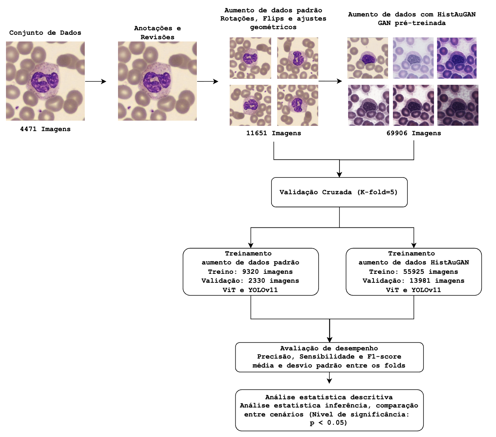

# 🧬 Comparative Analysis of YOLOv11 and Vision Transformers for Leukocyte Classification  
### Enhanced by Domain-Oriented Generative Color Augmentation (HistAuGAN)

<p align="center">


</p>

---

# 👨‍🔬 Authors

**João Kasprowicz**  
MSc Candidate  

**Alexandre Gonçalves Silva, PhD**  
Professor and Research Advisor  

Federal University of Santa Catarina (UFSC)

---

# 📌 Overview

Differential leukocyte counting is essential for hematological diagnosis.  
Manual smear analysis remains time-consuming, subjective, and sensitive to staining variability between laboratories.

This study presents a systematic comparative evaluation between:

- YOLOv11 (Nano, Small, Medium)
- Vision Transformers (ViT-Small, ViT-Base)

for **14-class leukocyte and artifact classification** using a public dataset published on Zenodo:

[](https://zenodo.org/records/17743609)

Additionally, we evaluate the impact of **HistAuGAN**, a generative adversarial stain augmentation strategy designed to simulate realistic inter-laboratory staining variability and improve domain robustness.

---

# 🧪 Pipeline

<p align="center">

</p>

---

# 🎯 Main Contributions

- Direct architectural comparison under identical experimental protocol
- 5-fold cross-validation with statistical validation
- Domain-oriented generative augmentation (**HistAuGAN**)
- Zero-shot, Proto-shot and Linear Probing evaluation
- Out-of-distribution generalization analysis (**PBC** and **LISC** datasets)
- Effect size reporting (**Kendall’s W**, **r_rb**)

---

# 🧪 Dataset

## Private Clinical Dataset

Original dataset  
**4,471 smear images**

After cell extraction and preprocessing  
**11,651 cell images**

Characteristics:

- 14 leukocyte and artifact categories
- Triple-review annotation protocol
- Ethics approval: UFSC (CAAE: 83684524.7.1001.0121)

---

## Data Split

| Subset | Images |
|------|------|
| Training | 9,320 |
| Validation | 1,165 |
| Test | 1,166 |

With **HistAuGAN augmentation**

→ Training expanded to **55,925 images**

---

# 🏗 Architectures Evaluated

## YOLOv11

- YOLOv11-Nano
- YOLOv11-Small
- YOLOv11-Medium

## Vision Transformer (ViT)

- ViT-Small
- ViT-Base

All models were **fine-tuned from ImageNet pretrained weights**.

---

# 📊 Results (Macro Average – 5-Fold Cross-Validation)

## Without HistAuGAN

| Model | Precision (%) | Sensitivity (%) | F1-score (%) |
|------|------|------|------|
| YOLOv11-Nano | 88.37 ± 1.06 | 88.47 ± 2.00 | 88.41 ± 1.23 |
| YOLOv11-Small | 89.14 ± 0.70 | 90.71 ± 1.58 | 89.91 ± 0.64 |
| YOLOv11-Medium | 85.89 ± 1.43 | 88.00 ± 1.42 | 86.92 ± 0.82 |
| ViT-Small | 95.33 ± 0.33 | 96.07 ± 0.95 | 95.59 ± 0.61 |
| **ViT-Base** | **94.67 ± 3.81** | **97.48 ± 1.44** | **95.84 ± 2.76** |

Statistical Analysis:

- Friedman Test: **p < 0.05**
- Kendall’s W > **0.85** (large effect size)
- ViT architectures statistically superior before advanced augmentation

---

## With HistAuGAN

| Model | Precision (%) | Sensitivity (%) | F1-score (%) |
|------|------|------|------|
| YOLOv11-Nano | 97.48 ± 0.27 | 98.07 ± 0.82 | 97.77 ± 0.34 |
| YOLOv11-Small | 98.81 ± 0.19 | 99.16 ± 0.32 | 98.99 ± 0.13 |
| YOLOv11-Medium | 98.62 ± 0.31 | 99.13 ± 0.40 | 98.87 ± 0.31 |
| **ViT-Small** | **98.98 ± 0.23** | **99.07 ± 0.24** | **99.02 ± 0.20** |
| ViT-Base | 97.82 ± 1.35 | 98.88 ± 0.45 | 98.31 ± 0.90 |

After HistAuGAN:

- All architectures exceeded **97% macro F1-score**
- Reduced performance gap (**Kendall’s W ≈ 0.5**)
- Advanced augmentation acted as a **capacity equalizer**

---

# 🌍 Out-of-Distribution Generalization

## Zero-Shot

| Dataset | Accuracy (%) | F1-score (%) |
|------|------|------|
| PBC | 77.48 | 74.43 |
| LISC | 7.44 | 6.91 |

Severe domain shift observed in **LISC**.

---

## Linear Probing (Frozen Backbone)

| Dataset | Accuracy (%) | F1-score (%) |
|------|------|------|
| PBC | 98.88 ± 0.21 | 98.67 ± 0.23 |
| LISC | 91.73 ± 1.85 | 91.06 ± 2.37 |

These results indicate **highly transferable morphological representations**.

---

# 🧠 Scientific Insights

- Transformers outperform CNN-based detectors under limited augmentation
- Domain-oriented generative augmentation significantly reduces architectural disparity
- Modeling staining variability is as important as architectural complexity
- ViT representations remain robust under domain shift

---

# 🔬 Experimental Protocol

- 5-Fold Cross-Validation
- Macro Precision, Recall, F1-score
- Friedman Test + Conover Post-hoc
- Effect Size (Kendall’s W, r_rb)
- Confusion matrix analysis

Hardware used:

**NVIDIA HGX H100 (VLAB@UFSC)**

---

# 🔍 Model Explainability

To analyze model decision patterns we generated attention and activation maps using:

• **Attention Rollout** for Vision Transformers  
• **EigenCAM** for YOLOv11 architectures  

These visualizations highlight the morphological regions most relevant to model predictions.

Examples are provided in the dissertation appendix.

---

# ⚡ Quick Start

Clone the repository:

```bash
git clone https://github.com/jkasprowicz/leukocyte-classification-vit-vs-yolo
cd leukocyte-classification-vit-vs-yolo

Install dependencies:
pip install -r requirements.txt

🧪 Dataset Preparation
Download dataset from zenodo

use /srs/data_utils to unify the dataset into all to use augmentation (HistAuGAN)

🧠 Training Models
Vision Transformer
python src/models/vit/train_vit.py

Available models:
ViT-Small
ViT-Base

YOLOv11
python src/models/yolo/train_yolo.py

Available models:
YOLOv11-Nano
YOLOv11-Small
YOLOv11-Medium

🎨 HistAuGAN Augmentation
To expand the training dataset with stain variability:
python src/augmentations/histaugan.py
```

# 📄 Associated Publication
```
This repository is associated with a research manuscript currently under review at the journal *Signal, Image and Video Processing*.

A preprint version of a related study is available at Research Square:

https://www.researchsquare.com/article/rs-7926842/v1

The preprint presents an earlier version of the experimental framework that partially overlaps with the methodology used in this repository.  
The current repository reflects the expanded experimental protocol developed during the author's MSc dissertation at the Federal University of Santa Catarina (UFSC).
```

📖 Citation
```bash
@article{kasprowicz2026leukocyte,
  title={Comparative Analysis of YOLOv11 and Vision Transformers for Automated Leukocyte Classification Enhanced by Generative Color Augmentation},
  author={Kasprowicz, Joao and Silva, Alexandre Goncalves},
  year={2026}
}
```


